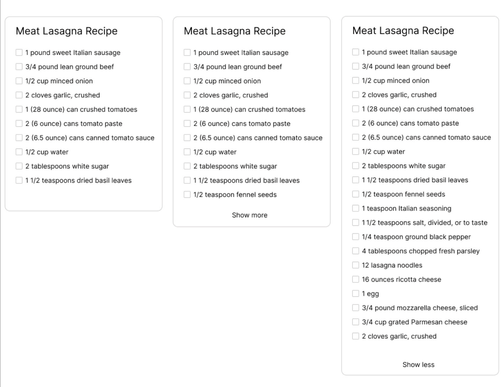

# Kagi FE Demo Project

Welcome to your Kagi demo project!

A few guidelines:

- The tasks can be solved in a variety of ways, do it in a way that will show off your skills as a developer.
- Deliverable is a Github repo. A direct link to try the solution is desirable.
- Deadline for submission is two weeks or sooner

Thank you for participating. Good luck and have fun!

## Task 1 - HTML Recipes



- [x] Make a recipe widget as shown in the image.
- [x] Clicking Show more' should expand the content of the widget.
- [x] The text should change to 'Show less.
- [x] Clicking Show Less should collapse the content.
- [x] 'Show more' should only be visible if Ingredients exceed 10.
- [x] There is no need to add, edit, or delete Ingredients for this widget, the idea is to make
- [x] Show more/Show less' functionality WITHOUT javascript.
- [x] Make 2 examples, one with checkboxes like shown in the image. Another with just a text, for the second example, there should be 15 lines (or more) of text, 10 lines of text should be visible when collapsed and when expanded another 5 should show up.
- [x] No JavaScript at all for this one.

## Task 2 - JavaScript optimization

You are at the court for a traffic ticket and there are 4 other people with you. You are told that everyone’s hearing is in alphabetical order and it takes 30 minutes for each hearing. All of the judges are free now and can see one person at a time. How long will it take for your hearing to end?

Your inputs are:

`string` - your name
`int` - number of judges
`string` - names of four other people separated by space

Example:
```js
court(“Jules", 3, "Adam Betty Frank Mike”)
60
```

```js
court(“Zane", 1, "Mark Hank Ana Vivian")
150
```

Write the fastest JavaScript routine (include a simple benchmark) that you possibly can. Submit when you can not get it any faster and explain your optimization journey.